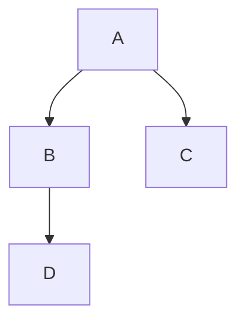

# Teste de Recursos MDX

<Cover
  src="https://cdn.cosmos.so/affd4b79-e848-4dfd-bd42-5f2c4a847365?format=jpeg"
  alt="Image from the movie Alien - from cosmos.com"
  caption="cosmos.com"
/>

## Tabela

| Comando | Descrição |
|---------|-----------|
| `npm run dev` | Inicia o servidor de desenvolvimento |
| `npm run build` | Gera o build de produção |

## Imagem

## Mermaid

